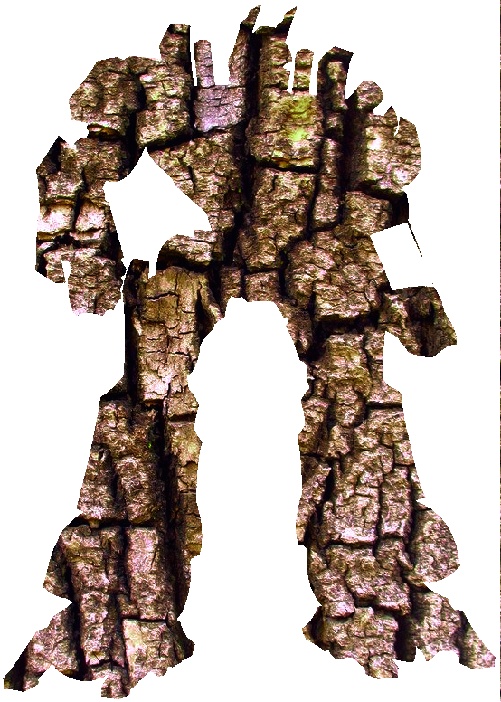

<p align="center">

  

<br>


<h1><p align="center">General Bark - A C based shell</h1></p></font>

# General Bark

General Bark is a C-based shell that sits on top of the kernel. It aims to provide a more user-friendly interface for interacting with the kernel, hence the name "Bark" (like the tree bark). General Bark includes most of the basic commands found in the bash shell and communicates them to the kernel in a streamlined manner. The shell was initially built as a group project for learning C and is now being rebuilt to further explore the other parts of the project that were not covered by the group.

## Compilation and installation

General Bark can be compiled with GCC version 4.8.5 or higher. To launch the shell after compiling, simply run `./gbk` which will prompt the terminal with `$ `.

If you want to install the shell, you can clone this repository to your local machine and compile all the `c` files using GCC. Or if you are looking for a binary you can run the program just like others, such as bash. But depending on your machine the compiled version might not work so you can compile the program as follows:

First
```
git clone https://github.com/hileamlakB/GBK.git
```
Then
```
cd GBK
```
After this you can use the make file to compile every thing as follows
```
make
```
## Syntax

The shell operates using commands inputted by the user, taking the following syntax: `command name {arguments}[;||&& other command]`. The shell will execute the command along with its arguments until all commands in one line are completed. For example, `cat gbk.h` will take in the command `cat` (to view a file without opening it) followed by the argument `gbk.h` (the file name).

## Built-ins

General Bark also includes built-in functions, which are commands within the shell itself. Some of these built-ins include `alias`, `help`, `cd`, `history`, `env` and `printenv`, `set`, `exit`, and `unset`.

## Exiting commands and the shell

To exit out of a command or process, the user can use the `exit` command or send a SIGKILL signal from the parent process. Alternatively, the user can use `ctrl D` which will exit the shell and give an exit status of 0. `Control c (SIGINT)` has been overridden to do nothing, as in many shells.

## Author

This project was initially built as a group project, but is now being rebuilt by the author to further explore the other parts of the project that were not covered by the group.

## Files
* `README.md` : Current file, contains information about this project
* `gbk.h` : Header file, contains all prototypes for funcitons used, as well as libriaries
* `help.h` : Header file, contains all the macros for the help section...

## Additional Features

General Bark includes additional features that are yet to be built. These include:
- [ ] Adding tab completion for commands
- [ ] Implementing a command history feature
- [ ] Allowing for command line editing
- [ ] Adding the ability to handle signal interrupts
- [ ] Implementing a built-in command for handling background processes
- [ ] Adding support for wildcard characters in commands

## Limitations

General Bark is


Finally you can run it with 
```
./gbk
```

## Syntax

The shell operates using commands inputted by the user, taking the following syntax: `command name {arguments}[;||&& other command]`. The shell will execute the command along with its arguments until all commands in one line are completed. For example, `cat gbk.h` will take in the command `cat` (to view a file without opening it) followed by the argument `gbk.h` (the file name).

## Built-ins

General Bark also includes built-in functions, which are commands within the shell itself. Some of these built-ins include `alias`, `help`, `cd`, `history`, `env` and `printenv`, `set`, `exit`, and `unset`.

## Exiting commands and the shell

To exit out of a command or process, the user can use the `exit` command or send a SIGKILL signal from the parent process. Alternatively, the user can use `ctrl D` which will exit the shell and give an exit status of 0. `Control c (SIGINT)` has been overridden to do nothing, as in many shells.

## Author

This project was initially built as a group project, but is now being rebuilt by the author to further explore the other parts of the project that were not covered by the group.

## Files
* `README.md` : Current file, contains information about this project
* `gbk.h` : Header file, contains all prototypes for funcitons used, as well as libriaries
* `help.h` : Header file, contains all the macros for the help section...

## Additional Features

General Bark includes additional features that are yet to be built. These include:
- [ ] Adding tab completion for commands
- [ ] Implementing a command history feature
- [ ] Allowing for command line editing
- [ ] Adding the ability to handle signal interrupts
- [ ] Implementing a built-in command for handling background processes
- [ ] Adding support for wildcard characters in commands

